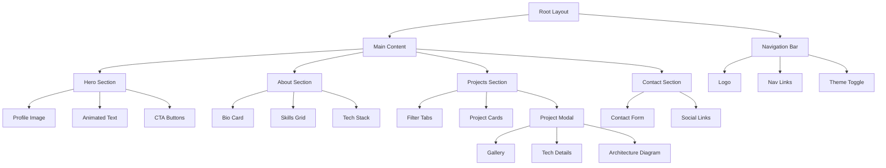

# Neumorphism Portfolio Architecture Plan

## 🎨 Design System Overview

### Color Palette
- **Base Background**: #e0e5ec
- **Light Shadow**: #ffffff
- **Dark Shadow**: #a3b1c6
- **Accent Color**: #6c63ff (for CTAs and highlights)
- **Text Primary**: #2d3748
- **Text Secondary**: #718096

### Neumorphism Design Principles
1. **Soft UI Elements**: All interactive elements use dual shadows (light and dark)
2. **Depth Levels**: 
   - Level 0: Flat (pressed state)
   - Level 1: Subtle elevation (default cards)
   - Level 2: Medium elevation (hover states)
   - Level 3: High elevation (modals, popups)
3. **Border Radius**: Consistent 20px for large elements, 12px for small elements
4. **Transitions**: 0.3s ease for all interactions

## 🏗️ Component Architecture



## 📁 File Structure

```
src/
├── components/
│   ├── navigation/
│   │   ├── NavBar.tsx
│   │   └── NavBar.module.css
│   ├── hero/
│   │   ├── HeroSection.tsx
│   │   ├── AnimatedText.tsx
│   │   └── ProfileImage.tsx
│   ├── about/
│   │   ├── AboutSection.tsx
│   │   ├── SkillCard.tsx
│   │   └── TechStack.tsx
│   ├── projects/
│   │   ├── ProjectsSection.tsx
│   │   ├── ProjectCard.tsx
│   │   ├── ProjectModal.tsx
│   │   └── FilterTabs.tsx
│   ├── contact/
│   │   ├── ContactSection.tsx
│   │   ├── ContactForm.tsx
│   │   └── SocialLinks.tsx
│   └── common/
│       ├── NeumorphicButton.tsx
│       ├── NeumorphicCard.tsx
│       └── SmoothScroll.tsx
├── styles/
│   ├── neumorphism.css
│   ├── animations.css
│   └── responsive.css
├── data/
│   ├── projects.ts
│   ├── skills.ts
│   └── social.ts
└── routes/
    └── index.tsx (main portfolio page)

```

## 🚀 Technical Implementation Details

### 1. Neumorphic CSS Classes
```css
.neumorphic {
  background: #e0e5ec;
  border-radius: 20px;
  box-shadow: 
    9px 9px 16px #a3b1c6,
    -9px -9px 16px #ffffff;
}

.neumorphic-inset {
  box-shadow: 
    inset 5px 5px 10px #a3b1c6,
    inset -5px -5px 10px #ffffff;
}

.neumorphic-hover {
  transition: all 0.3s ease;
}

.neumorphic-hover:hover {
  box-shadow: 
    12px 12px 20px #a3b1c6,
    -12px -12px 20px #ffffff;
}
```

### 2. Smooth Scroll Implementation
- Use Intersection Observer API for scroll-triggered animations
- Implement custom smooth scroll behavior for navigation
- Add parallax effects for depth perception

### 3. Project Data Structure
```typescript
interface Project {
  id: string;
  title: string;
  description: string;
  category: 'frontend' | 'backend' | 'fullstack' | 'mobile';
  technologies: string[];
  images: string[];
  liveUrl?: string;
  githubUrl?: string;
  architecture?: {
    diagram: string;
    description: string;
  };
  features: string[];
  challenges: string[];
  outcomes: string[];
}
```

### 4. Performance Optimizations
- Lazy load images using Qwik's Image component
- Code split by route
- Implement virtual scrolling for large project lists
- Use CSS containment for better paint performance
- Optimize animations with `will-change` and GPU acceleration

### 5. Responsive Design Breakpoints
- Mobile: 320px - 768px
- Tablet: 768px - 1024px
- Desktop: 1024px+

### 6. Accessibility Features
- ARIA labels for all interactive elements
- Keyboard navigation support
- Focus indicators with neumorphic style
- Screen reader friendly content structure
- Reduced motion support

## 🎯 Key Features

1. **Animated Hero Section**
   - Typewriter effect for introduction
   - Floating profile image with neumorphic frame
   - Animated skill badges

2. **Interactive Project Showcase**
   - Filter by technology/category
   - Expandable cards with detailed views
   - Live preview in modal
   - Architecture diagram viewer

3. **Skills Visualization**
   - Animated progress bars
   - Interactive tech stack grid
   - Categorized skill sections

4. **Contact Integration**
   - Neumorphic form inputs
   - Form validation with visual feedback
   - Social media links with hover effects

5. **Micro-interactions**
   - Button press effects
   - Card lift on hover
   - Smooth transitions between sections
   - Loading animations

## 📱 Progressive Enhancement

1. **Base Experience**: Static HTML/CSS works without JavaScript
2. **Enhanced Experience**: Full interactivity with Qwik hydration
3. **Offline Support**: Service worker for offline viewing
4. **PWA Features**: Installable as app

## 🔧 Development Phases

### Phase 1: Foundation (Current)
- Set up design system
- Create base components
- Implement navigation

### Phase 2: Content Sections
- Build hero section
- Develop about section
- Create projects showcase

### Phase 3: Interactivity
- Add animations
- Implement filtering
- Create modals

### Phase 4: Polish
- Responsive design
- Performance optimization
- Accessibility audit

### Phase 5: Enhancement
- Dark mode toggle
- Advanced animations
- PWA features